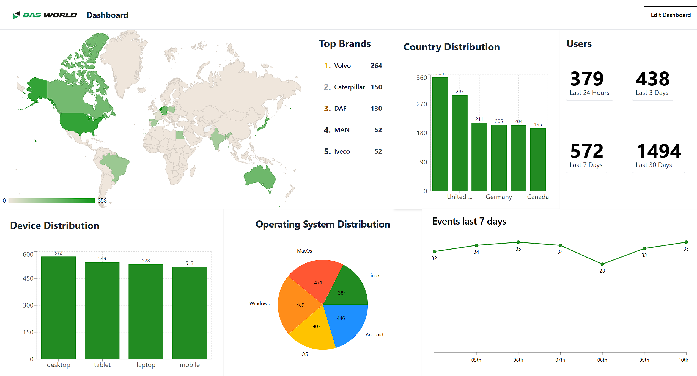
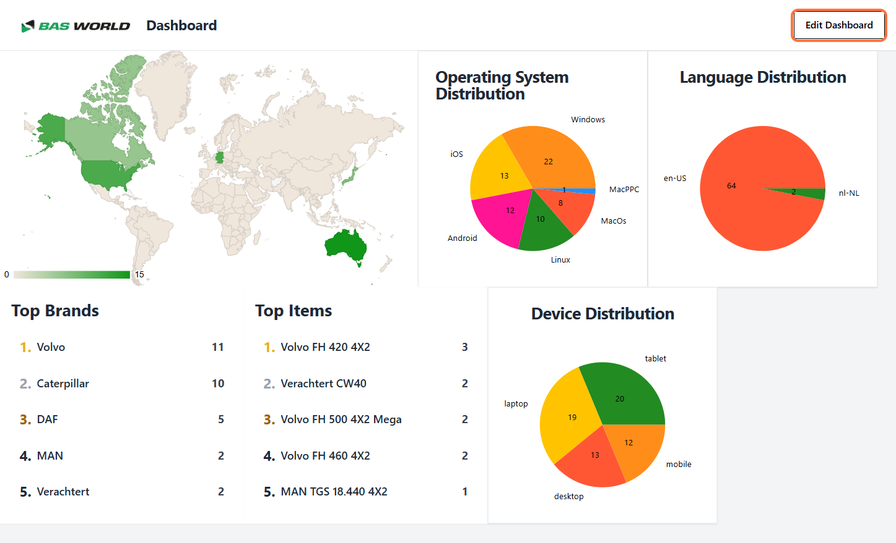

<h1 align="center">
  <br>
  
  <br>
  BAS World Dashboard
  <br>
</h1>

<h4 align="center">A web dashboard that displays data stored in a MongoDB database. Created for <a href="https://www.basworld.com/">BAS World</a>.</h4>

<!-- Horizontal short Menu (w\ Links) -->
<p align="center">
  <a href="#key-features">Key Features</a> •
  <a href="#how-to-use">How To Use</a> •
  <a href="#gallery">Gallery</a> •
  <a href="#retrospective">Retrospective</a> •
  <a href="#credits">Credits</a>
</p>

## Key Features

- Customizable dashboards
- Various data sources and display formats
- Save custom dashboards and reaccess them anytime through a html link
- Backend receives and stores data automatically
- Real-time (web socket) updates
- Backend exposes a data API for you to make your own custom data display
- Thorough Documentation for users and developers
- CI/CD Pipeline integration

<div align=center>

</div>

## How To Run

This project includes comprehensive documentation made with [Docusaurus](https://docusaurus.io/). If you want to know more about the project or how to run it, simply run the Docusaurus website and read the instructions to your heart's content. The website also includes more explanation on how the website works and how it was made.

### Docusaurus

To run Docusaurus you will need [Git](https://git-scm.com/) to clone this project and [Node.js](https://nodejs.org/en) to run the Javascript.

```bash
# Clone the Git repository
$ git clone https://github.com/N4fta/BAS-World-Dashboard.git

# Go into the backend folder
$ cd BAS-World-Dashboard/docusaurus

# Install dependencies
$ npm install

# Start the server
$ npm start
```

## Gallery

<div align=center>





</div>

## Retrospective

This project helped me realise the beauty of pipelines. Automation is truly great when working on big projects and/or when working with a big group, although SonarQube can be annoying with all its checks. This is definitely something I will carry over to the next project.

I also realized most modern apps actually run on multiple services that are containerized, isolated, but standardized via APIs (or similar protocols), so they can be swapped out without affecting the rest of the ecosystem. This is a great concept that I will definitely use in my next project.

And to this end, I finally properly learned about async coding. I had dabbled in threading with Python before, but for API calls using JavaScript, I had to learn about more complex Async calls and using the result back in the main call.

I also felt the importance of a strongly typed language when coding; ever since I started using C# and OOP principles, I inandevertly started relying on type inference and checks more and more. Instead of remembering methods and parameters for a class I created a week ago, I would rely on the suggestions from my code editor. I also didn't necessarily need to check that a method existed before calling it. However, since we used pure JavaScript, the code became harder, slower, and more confusing to write. Specially when you have multiple people contributing, and you did not make all the classes, it becomes confusing really fast. And something that before would have taken me a quick scroll through the methods available took 5-10 minutes of research (for example, when using Axios classes and calls). I will definitely use TypeScript next time. However, this was still a good opportunity to learn about how much I relied on my tools and be more aware of them.

The final concept I want to take away from this experience is Docker. Docker is amazing. From making my application runnable anywhere to defining the environment in a file that I can then execute with one command is amazing. It allows for easy testing in pipelines, quick starting of the software on other devices, and generally controlling your whole environment. My Docker containers were only connected to each other through some endpoints, great for scalability and modifications. And I didn't have to install a bunch of stuff to make them work, MySQL was only installed in the container, and the moment I delete it, it goes with it. Leaving my environment clean. In a way, similar to a Python virtual environment.

But of course, it also has its disadvantages. Notably, since data is stored separately and images only provide a clean starting point, we had some issues with sharing data since the database was local. This could be fixed by hosting one online, but we choose not to. It also adds extra complexity to a project, and depending on scale, sometimes less is more.

## Credits

This software uses the following open source packages:

- [Vite](https://vite.dev/)
- [React](https://react.dev/)
- [ShadCN](https://ui.shadcn.com/)
- [Tailwind CSS](https://tailwindcss.com/)
- [Axios](https://www.npmjs.com/package/axios)
- [Chart.js](https://www.chartjs.org/)

---

- [SpringBoot](https://spring.io/projects/spring-boot)
- [Mockito](https://site.mockito.org/)
- [SonarQube](https://www.sonarsource.com/products/sonarqube/)

---

- [Docker](https://www.docker.com/)
- [MongoDB](https://www.mongodb.com/)
- [GitLab](https://about.gitlab.com/)
- [Docusaurus](https://docusaurus.io/)

Created with the help of some Fontys students at [Fontys](https://www.fontys.nl/).

### My Links

> [neo-dev.org](https://neo-dev.org) &nbsp;&middot;&nbsp;
> GitHub [@N4fta](https://github.com/N4fta)
