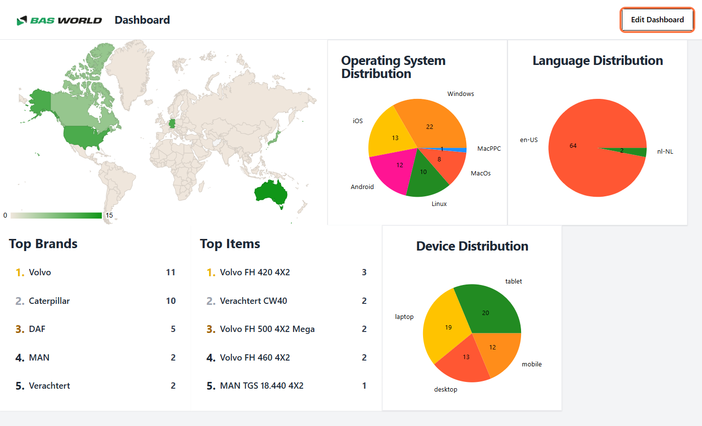
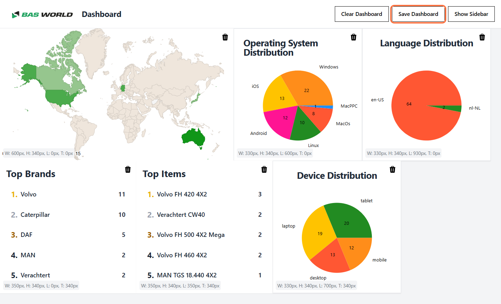
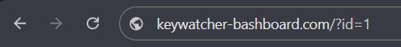

# How to Save Layouts  

## Overview  
Saving your layout is essential to preserve your custom dashboard settings. Once saved, you can share your personalized view with others using a unique URL. This guide explains how to save your layout and the benefits of doing so.

---

## Steps to Save Your Layout  

1. **Enter Edit Mode**  
   - To save a layout, ensure you are in **Edit Mode**. Edit Mode allows you to customize and rearrange your dashboard widgets.  

2. **Click "Save Layout"**  
   - Locate the **"Save Layout"** button on the top navigation bar of the dashboard.  
   - Click the button to initiate the saving process.  

  

3. **Receive a Unique URL**  
   - After clicking the "Save Layout" button, the system will generate a unique URL corresponding to your saved layout.  
   - Use this link to revisit your layout or share it with others.  

     

---

## Features of Saved Layouts  

- **Preservation of Customization**  
   - Save your widget arrangement, color themes, and other personalized settings.  

- **Easily Shareable**  
   - Share the unique URL with colleagues or team members to showcase your customized dashboard.  

- **Access from Anywhere**  
   - Revisit your saved layout from any device by simply opening the generated link.  

- **Collaboration Made Easy**  
   - Collaborate effectively by sharing consistent dashboard views with your team.  
