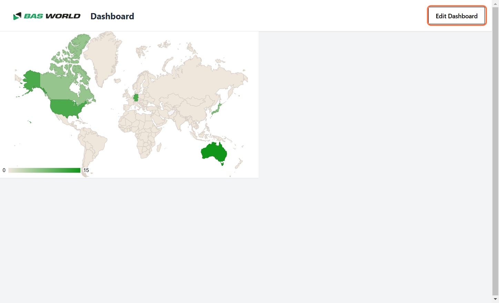
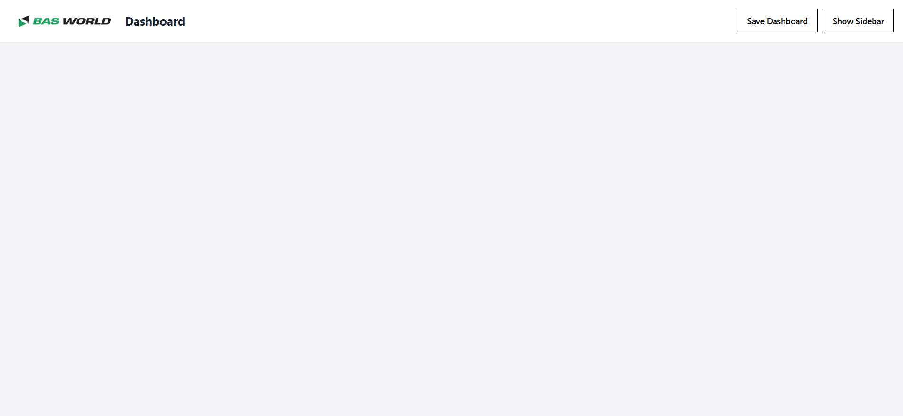

# Removing Widgets from the Dashboard

Follow these simple steps to remove a widget from the dashboard:

---

## Step 1: Enable Edit Mode
Click the **"Edit Dashboard"** button to enable edit mode.  

---

## Step 2: Remove the Widget
Click on the **🗑 (Trash)** icon located on the widget you want to remove.  

---

## Step 3: Widget Removed
The widget is now successfully removed from your dashboard.  

---

By following these steps, you can easily declutter your dashboard and keep only the widgets you need.
