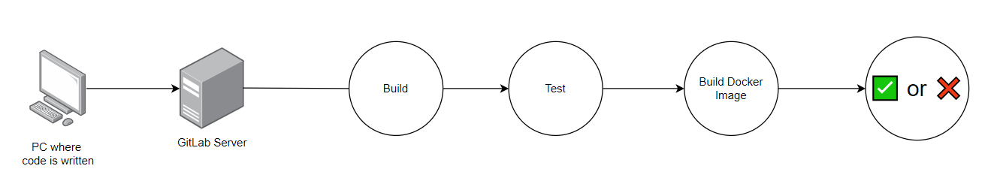

# Back-end Pipeline

The Back-end CI/CD pipeline automates the process of building, testing, and deploying the back-end application. Below is an overview of the pipeline's workflow:

1. **Code Development**: Code is written on the developer's PC.
2. **Code Push**: Code is pushed to the GitLab server.
3. **Build**: The pipeline builds the Java application using Gradle.
4. **Test**: Automated tests are executed to ensure code quality.
5. **Build Docker Image**: A Docker image of the application is created.
6. **Verification**: The pipeline determines whether the build passes all checks (✅) or fails (❌).