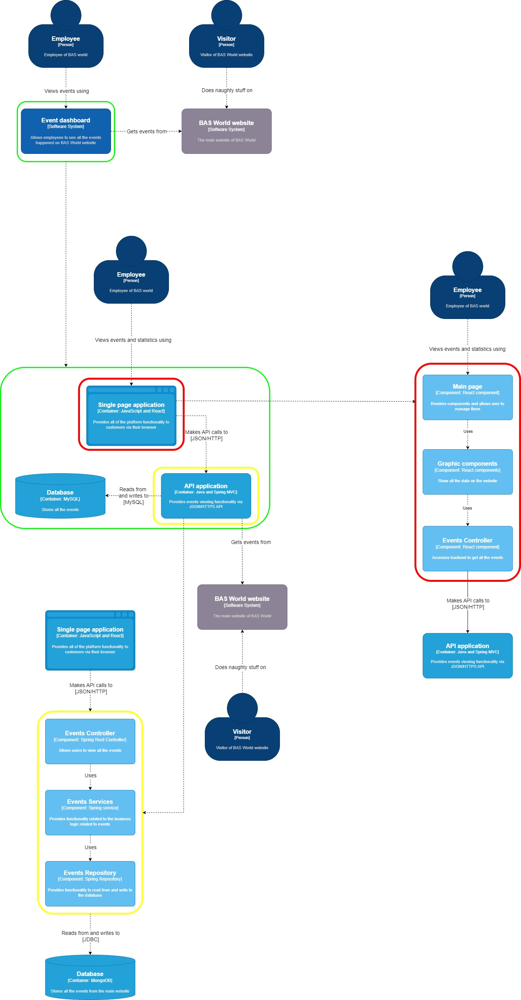

# C4 Diagram Introduction

The **C4 Model** is a visual framework for describing the architecture of software systems. It breaks down the system into four hierarchical levels:

1. **Context**: Provides a high-level overview showing users and external systems interacting with the system.
2. **Container**: Focuses on the system's main components (e.g., web apps, databases).
3. **Component**: Details the internal structure of each container, including services and APIs.
4. **Code (Optional)**: Represents the implementation details of specific components.

The C4 model simplifies architectural diagrams by emphasizing clarity, scalability, and context, making it easier for technical and non-technical stakeholders to understand system design.

## C3 Diagram: System Architecture Overview

The **C3 Diagram** provides a **high-level architectural view** of the system, focusing on how major components interact with each other. It visualizes the relationships between different services and databases.

---

### Overview

The diagram highlights the **Frontend Application (React.js)** communicating with the **Backend Service (Spring Boot)** via REST APIs. The backend manages **business logic** connects to a **database (MongoDB)** for persistent storage.

---

### Key Components:
- **Frontend Application:** Provides the user interface.
- **Backend Service:** Manages authentication, project data, and payments.
- **Database:** Stores user and project-related data.

---

<!--TO-DO : review diagram-->

---

This simplified C3 diagram offers a clear overview of the system’s structure, highlighting its core services and their interactions.