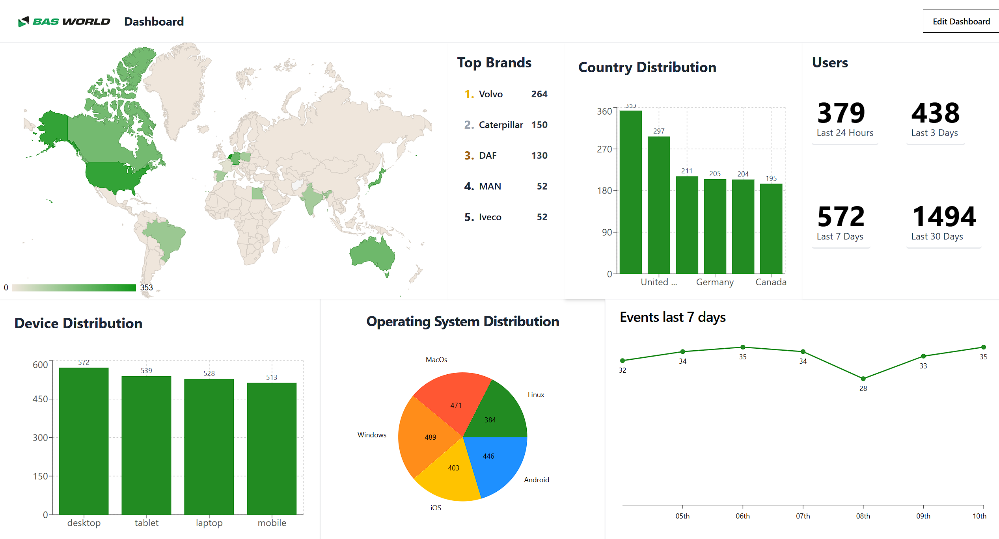

# Key Watcher Introduction

## Overview

Key Watcher is a dashboard developed during the 2024/2025 academic year at **Fontys University of Applied Sciences**. The project aims to provide **Bas World** with a user-friendly interface to monitor and analyze incoming data streams to their web application. Bas World is a leading platform for buying and selling commercial vehicles and equipment worldwide, with over 60 years of experience and a global reach.

The primary goal of this Dashboard is to offer a clear, user-friendly interface to display incoming data streams to the **Bas World web application**. The displayed data is structured according to the **JSON format** of the incoming information, ensuring consistency and accuracy in how the data is visualized and interpreted.

---

## Objectives

- **Data Visualization**: Provide a structured and intuitive visualization of the incoming data, making it easier for users to monitor and analyze critical metrics.
- **Widget-Based Architecture**: The Dashboard is modular, built using widgets, which allows flexibility in design, functionality, and customization.
- **User-Friendly Design**: Ensure that the Dashboard is easy to navigate and understand, even for users without a technical background.
- **Ease of Maintenance**: Facilitate updates and modifications to the Dashboard to accommodate evolving requirements with minimal effort.

---

## Features

1. **Dynamic Data Rendering**:
   - Displays real-time or near-real-time data streams received by the Bas World application.
   - Extracts and formats data directly from the JSON structure for easy comprehension.

2. **Widget-Based Dashboard**:
   - A flexible and customizable approach allows users to add, remove, or rearrange widgets to suit their specific needs.
   - Each widget is designed to focus on a particular metric or data set.

3. **Scalable and Modular Design**:
   - The architecture supports scalability, ensuring the Dashboard can grow with increasing data volumes.
   - Modular components make development and maintenance efficient.

4. **Customizable Views**:
   - Tailored views for different user roles or departments within Bas World.
   - Filters and settings enable personalized data visualization.