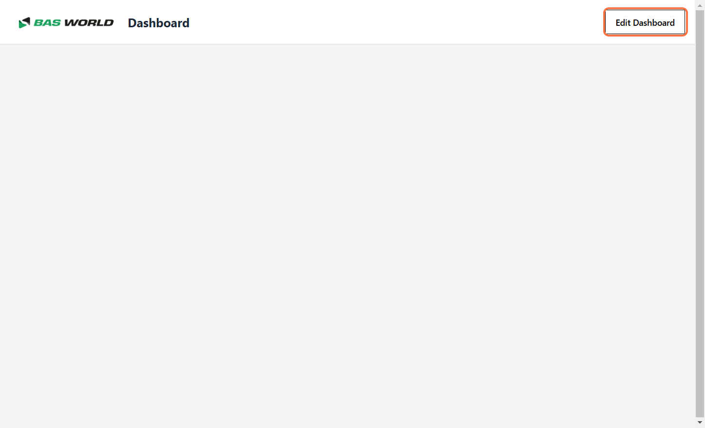
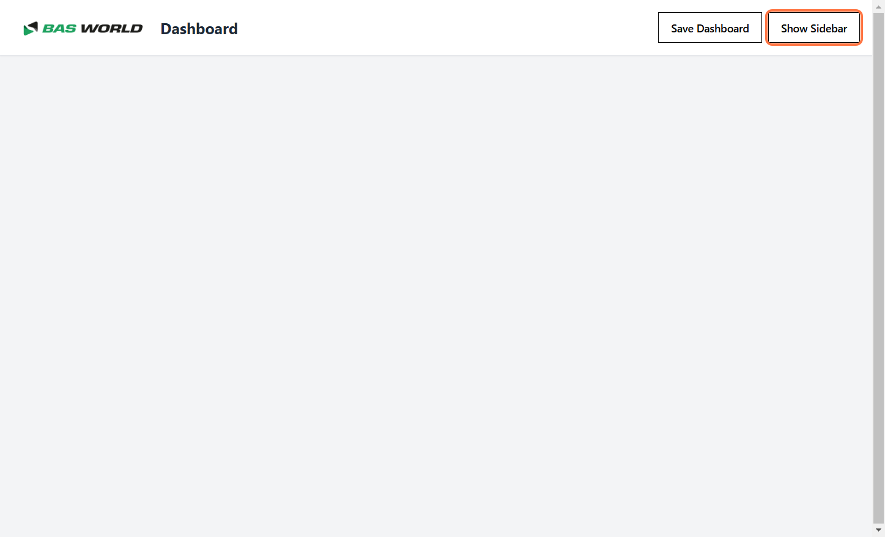
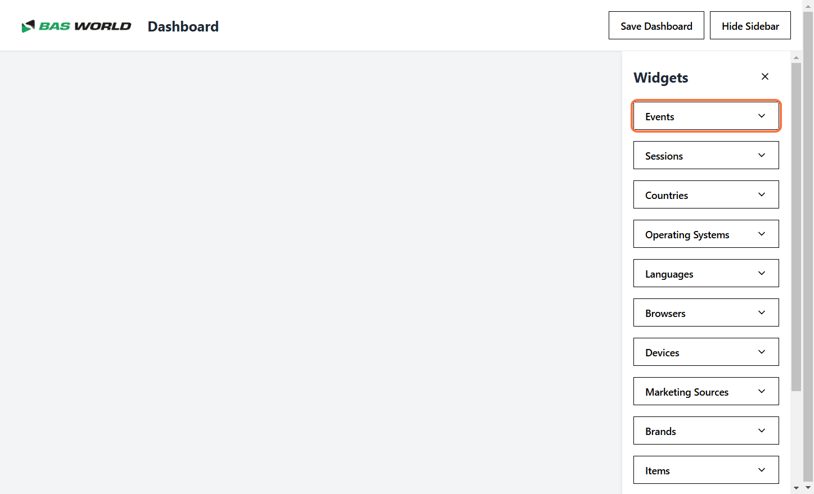
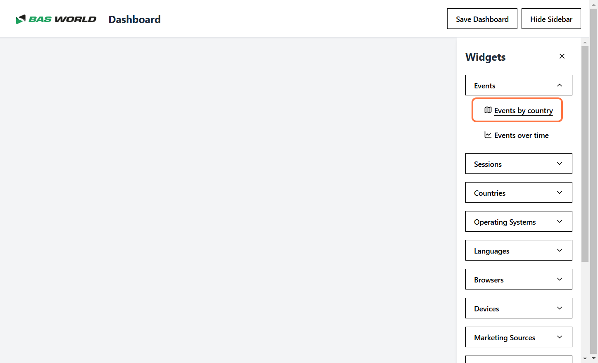
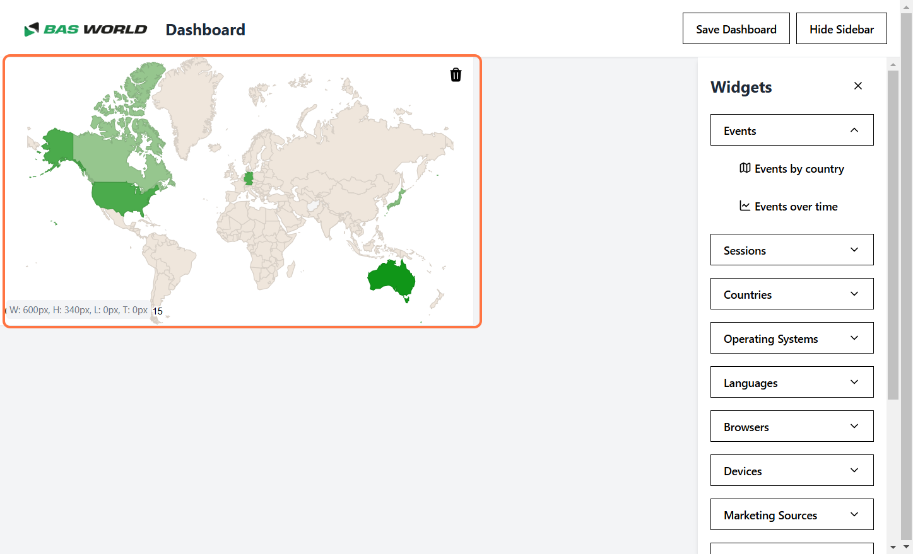
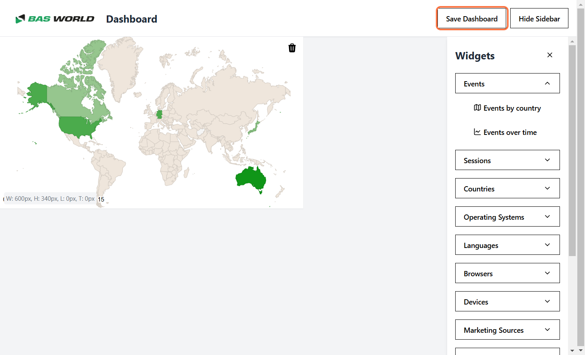
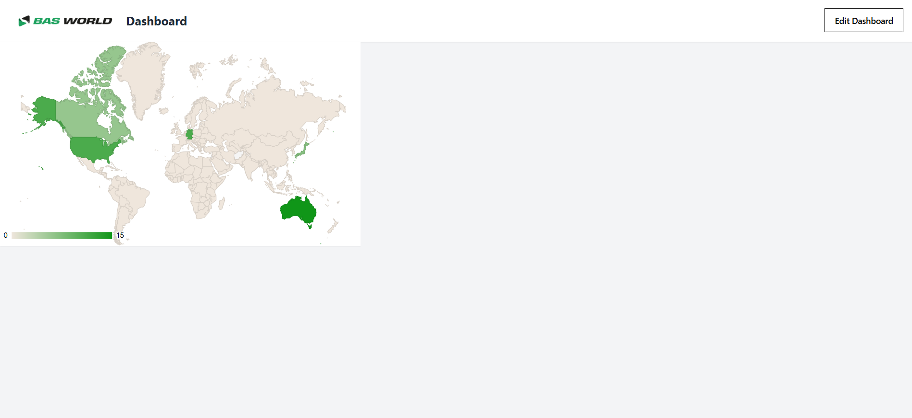

# Adding Widgets to the Dashboard

Follow these simple steps to add a widget to your dashboard:

## Step 1: Enable Edit Mode
Click the **"Edit Dashboard"** button to turn on edit mode.  

---

## Step 2: Open the Sidebar
Click the **"Show Sidebar"** button to display the widget options.  

---

## Step 3: Choose a Widget Category
Select the category that matches the type of widget you want to add.  
*Example: The "Events" category is selected in this case.*  

---

## Step 4: Add Your Widget
Click on the widget you want to add from the available options.  

---

## Step 5: Widget Placement
The selected widget will be placed in the first available space on the canvas.  

---

## Step 6: Save Your Layout
Click **"Save"** to lock in your changes. The layout is now fixed until you re-enter edit mode.  

---

## Step 7: View Your Updated Dashboard
Your dashboard now includes the new widget!  

--- 

By following these steps, you can easily customize your dashboard and make it more functional and tailored to your needs.
