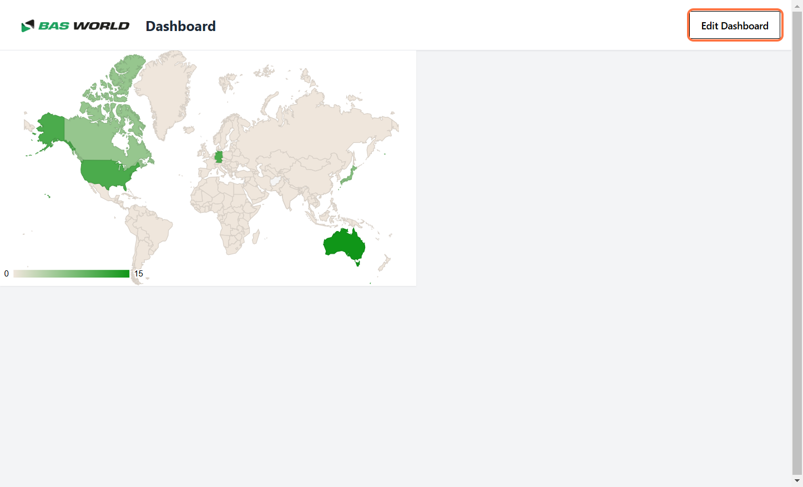
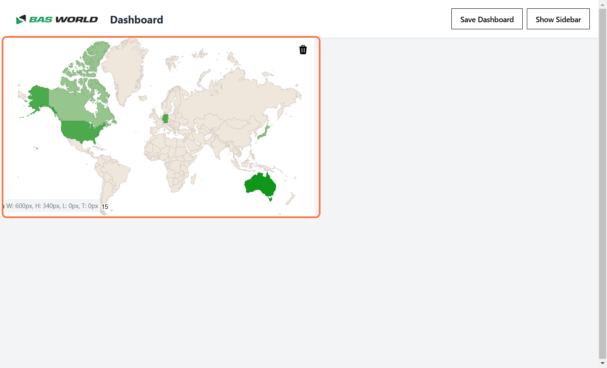
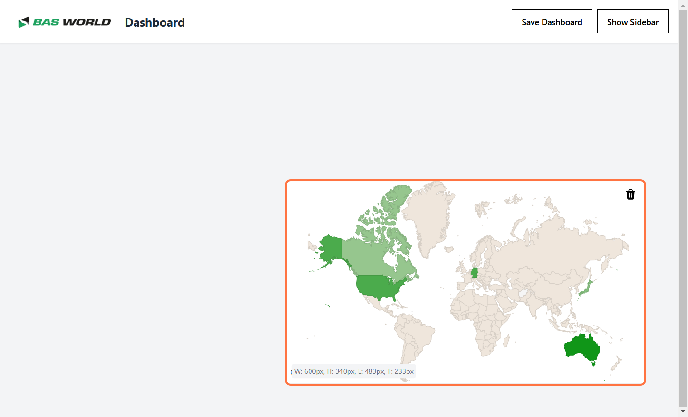

# Dragging Widgets Across the Dashboard

You can easily rearrange widgets on the dashboard by following these steps:

---

## Step 1: Enable Edit Mode
Click the **"Edit Dashboard"** button to activate edit mode.  

---

## Step 2: Drag the Widget
Click and hold on the widget you want to move. Drag it to the desired position on the canvas.  

---

## Step 3: Release to Place the Widget
Release the mouse click to drop the widget in the selected position.  
- If the widget is close to another widget or the edges of the canvas, it will automatically snap to the nearest position.  

---

By following these steps, you can rearrange widgets to customize your dashboard layout with ease.
