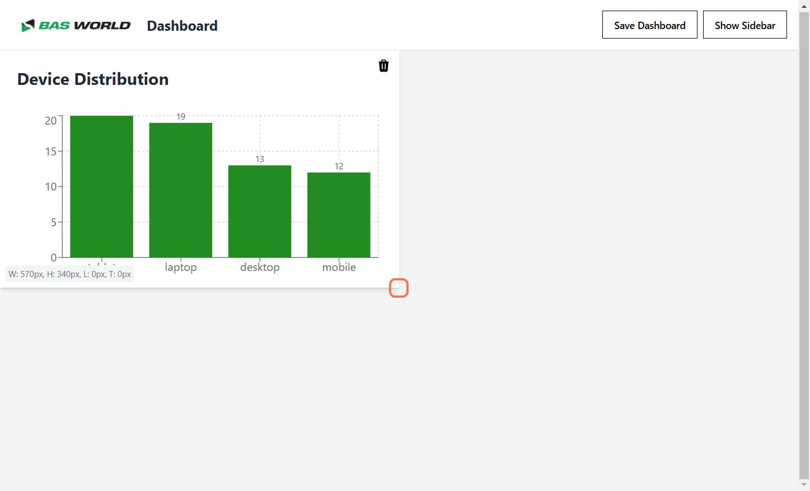
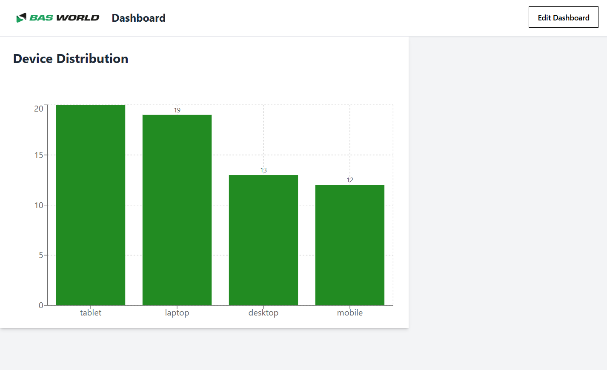

# Resizing Widgets

You can easily resize widgets on the dashboard by following these steps:

---

## Step 1: Enable Edit Mode
Click the **"Edit Dashboard"** button to enter edit mode.  
This allows you to resize your widgets.

---

## Step 2: Adjust Widget Size
Hover over the widget you want to resize, and drag on of the corners or sides to adjust its dimensions.

---

## Step 3: Preview the Resized Widget
As you drag, the widget dynamically resizes. You can see a live preview of the new dimensions.

---

## Step 4: Confirm Resizing
Once the widget is resized to your liking, release the mouse to apply the new size.

---

## Step 5: Save the Dashboard Layout
Click the **"Save Dashboard"** button to save your changes. Your resized widget will now remain in the updated layout.

---

By following these steps, you can easily customize the size of widgets on your dashboard to better suit your visualization needs.
